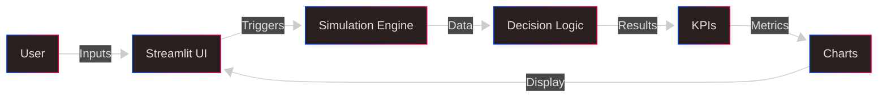

# Human–AI Workcell Evaluator  
### Industry 5.0 Human-Centric Decision Simulation
*A human-centric simulation project exploring how engineers and intelligent machines collaborate in manufacturing decision making under uncertainty. An Industry 5.0 concept.*

This project is a practical demonstration of **human–machine decision collaboration** under uncertainty, inspired by research on digital operations research for intelligent machines and human-centric Industry 5.0 systems.
Many manufacturing plants still lack full Industry 4.0 data foundations — this projects shows how engineers and managers can explore hybrid decision strategies *without requiring complex infrastructure*.

---

## Problem

Manufacturers face real challenges:

- AI and automation struggle with variability and uncertainty  
- Humans outperform automation in ambiguous decision points  
- Plants lack tools for experimenting with human–AI collaboration  
- Workforce training for AI-enabled environments is insufficient  
- Most OR models remain theoretical and disconnected from daily engineering practice  

This demo solves these gaps with a **data-light, simulation-first tool**.

---

## Solution Overview

The Human–AI Workcell Evaluator provides:

- A simulation environment comparing:  
  - **Machine-only automation**  
  - **Human-in-the-loop decision-making**  
- Adjustable uncertainty, noise, and decision thresholds  
- Clear KPIs:  
  - accuracy  
  - throughput  
  - cycle time  
  - human intervention rate  
- A simple, research-aligned platform for Industry 5.0 exploration  

---
## Architecture Diagram


---

## Algorithms Used

Simple, transparent models:
- Probabilistic machine decisions  
- Confidence → uncertainty threshold  
- Human override logic  
- Noise-based variability  
- Simulation over many parts (Monte Carlo style)  


---

## Demo

- Streamlit app  
- Adjustable decision parameters  
- Real-time charts  
- Human-vs-machine comparisons  

---

## How to Run

```bash
git clone <https://github.com/ElektraZee/Human-AI-Workcell-Evaluator/tree/main>
cd human-ai-workcell-evaluator

## Install Dependencies
pip install -r requirements.txt

##Run the Application
streamlit run hrcApp.py
```
---

## Future Work

- Multi-step production line simulation
- Human learning curve modeling
- Integration with Power BI
- Digital twin extensions
- Real operator feedback loop
- Policy simulation for Industry 5.0 transitions

---

## Skills Demonstrated

- Human–AI interaction design
- Operations research modeling
- Python simulation
- Streamlit UI development
- Industry 5.0 concepts
- Digital transformation prototyping
